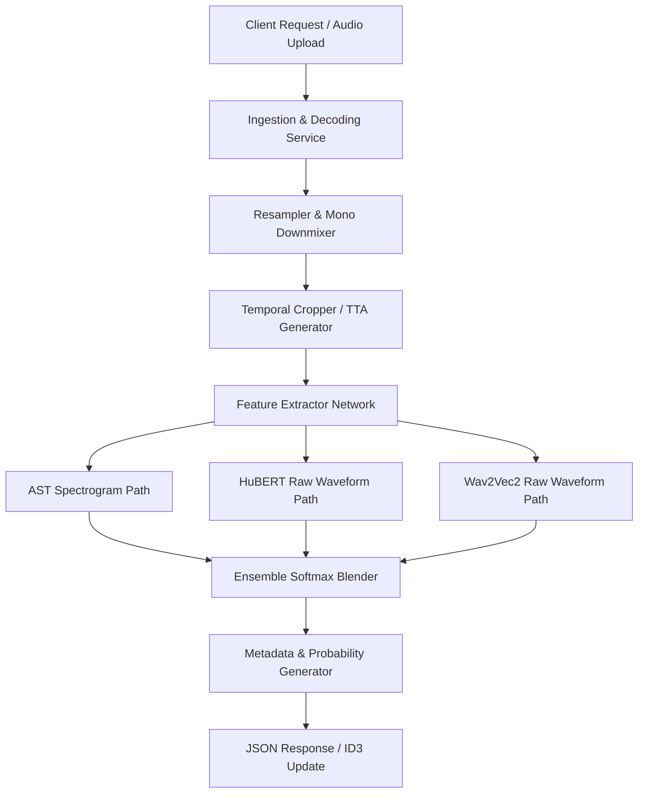

# Product Requirements Document (PRD)
## Production-Grade Music Genre Classification System

---

## Document Metadata
- **Project Name**: SOTA Music Genre Classification System (AST-Hubert-Wav2Vec2 Ensemble)
- **Status**: Proposed / Brainstorming
- **Target Release**: Q3 2026
- **Author**: Machine Learning Engineering Team

---

## 1. Executive Summary & Product Vision
The goal of this product is to transition our deep learning research prototypes (developed across Milestones 1 to 5) into a robust, enterprise-grade music genre classification service. By utilizing a state-of-the-art transformer ensemble (AST, HuBERT, and Wav2Vec2), the system will automatically classify user-uploaded audio files or streaming content into ten major musical genres with high accuracy. 

This service serves as a foundational component for streaming applications, media libraries, digital licensing platforms, and music archival workflows, helping automate curation and enhance recommendation algorithms.

---

## 2. Target Personas & Core Use Cases

### 2.1. Target Personas
- **Platform Engineer (Music Streaming Service)**: Needs a low-latency REST/gRPC API to run real-time genre classification on newly uploaded tracks before publishing them to the user feed.
- **Media Archivist (Radio/Digital Libraries)**: Needs a bulk-processing utility (batch classification) to scan millions of legacy audio files, clean up missing metadata, and generate taxonomy tags.
- **Independent Artist / Content Creator**: Interacts with a simple web interface to self-publish music, ensuring it gets correctly labeled for playlists and algorithms.

### 2.2. Core Use Cases
- **Automated Metadata Tagging**: Classifying music files on upload and updating ID3/metadata tags.
- **Dynamic Playlist Curation**: Analyzing song catalogs to bucket tracks into consistent acoustic genres.
- **Acoustic Fingerprinting & Classification**: Identifying structural genres even when track names, artists, or external metadata are completely stripped.

---

## 3. Product Features & Functional Requirements

### 3.1. Real-time Audio Ingestion and Preprocessing
- **Requirement**: The system must accept multiple audio file formats (including WAV, MP3, AAC, FLAC, and OGG).
- **Processing**: The ingestion service must automatically decode the audio, downmix multi-channel audio to mono (by averaging channels), resample to the target frequency of 16,000 Hz, and split/crop the audio to a standard evaluation duration of 25 to 30 seconds.

### 3.2. Ensemble Inference Engine (AST + HuBERT + Wav2Vec2)
- **Requirement**: The service must coordinate inference across the model ensemble.
- **Details**: The system must run parallel feature extraction (spectrogram patches for AST, raw waveforms for HuBERT and Wav2Vec2) and blend the softmax prediction distributions.
- **Test-Time Augmentation (TTA)**: Implement dynamic TTA=3 (evaluating three overlapping crops of the track) to generate a stable, duration-independent classification probability.

### 3.3. Probability Distributions & Multi-label Output
- **Requirement**: The API must return soft probabilities for all ten genres, rather than a hard argmax classification.
- **Details**: Because music tracks often cross genre boundaries (e.g. Pop-Rock or Hip-hop-Reggae), returning soft probabilities allows clients to implement custom thresholds or multi-label categorization.

### 3.4. Administrative Web Dashboard & HF Space Demo
- **Requirement**: Provide a web-based UI for manual testing.
- **Details**: Allow users to drag-and-drop audio files, visualize the resulting mel-spectrogram, view real-time confidence scores in horizontal bar charts, and download the updated metadata.

---

## 4. Non-Functional & Technical Requirements

### 4.1. Accuracy & Model Performance
- **Target**: Maintain a validation macro F1-score of 85% or higher across all ten target genres.
- **Noise Resilience**: The model must maintain classification robustness in noisy scenarios, utilizing training insights gained from Milestones 1 and 4 (synthetic environmental noise overlay).

### 4.2. Latency & Performance Targets
- **Inference Latency**: Single-track prediction (including file decoding, preprocessing, and model forward pass) must execute in under 300 milliseconds on a standard GPU instance (e.g. NVIDIA T4 or A10G).
- **Throughput Optimization**: The backend must employ Automatic Mixed Precision (AMP - Float16/BFloat16) and parallel data workers to maximize throughput during batch uploads.

### 4.3. Scalability & Containerization
- **Containerization**: Pack the entire preprocessing pipeline, models, and API layer into a single Docker container.
- **Deployment**: Deploy on Kubernetes or autoscaling container instances to handle variable traffic loads during peak upload windows.

---

## 5. System Architecture & Data Flow

---

## 6. Product Roadmap & Phases

### Phase 1: Research, Ingestion Pipeline & Model Ensemble (Completed)
- Build the core audio preprocessing and segmentation pipeline (Milestone 1 & 2).
- Establish CNN baselines and test noise injection logic (Milestone 3 & 4).
- Fine-tune AST and implement the Wav2Vec2/HuBERT ensemble models (Milestone 5).
- Deploy the functional MVP on Hugging Face Spaces for interactive user testing.

### Phase 2: Enterprise API & Batch Processing (Q4 2026)
- Develop containerized FastAPI service with gRPC endpoints.
- Integrate asynchronous queue-based batch processing (e.g. Celery + Redis) for folder uploads.
- Optimize inference speed using TensorRT or ONNX Runtime compilation.

### Phase 3: Personalization & Advanced Classification (Q1 2027)
- Expand classification taxonomy to support sub-genres (e.g. Synthwave, Indie Rock, Lo-fi Hiphop).
- Implement user-feedback loops to allow active learning (flagging incorrect labels to retrain the models).
- Port models to ONNX Mobile for on-device, offline classification on iOS and Android.
